# ERP Hub — Entity Relationship Diagram (ERD) & Data Flow

Complete database schema and application data-flow reference for the ERP Hub modular monolith.

**Database:** `ERPHub` (SQL Server)  
**ORM:** Entity Framework Core 10  
**DbContext:** `AppDbContext`  
**Pattern:** Controller → Service → Repository → `AppDbContext` → SQL Server

---

## Table of Contents

1. [High-Level Domain Overview](#1-high-level-domain-overview)
2. [Full ERD — Company & Organogram](#2-full-erd--company--organogram)
3. [Full ERD — Employee & HR](#3-full-erd--employee--hr)
4. [Full ERD — Shift & Attendance](#4-full-erd--shift--attendance)
5. [Full ERD — Leave Management](#5-full-erd--leave-management)
6. [Full ERD — Payroll & Compensation](#6-full-erd--payroll--compensation)
7. [Full ERD — Security & Identity](#7-full-erd--security--identity)
8. [Consolidated Master ERD](#8-consolidated-master-erd)
9. [Entity Reference Table](#9-entity-reference-table)
10. [Application Architecture Data Flow](#10-application-architecture-data-flow)
11. [Business Process Data Flows](#11-business-process-data-flows)
12. [Module-to-Table Mapping](#12-module-to-table-mapping)

---

## 1. High-Level Domain Overview

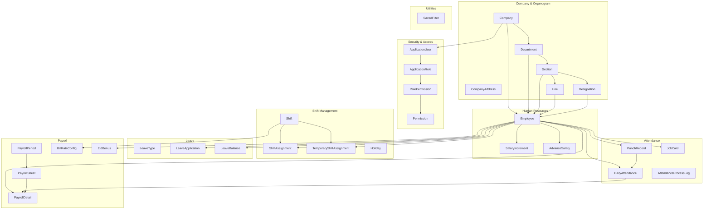

---

## 2. Full ERD — Company & Organogram

Organogram hierarchy: **Company → Department → Section → Line**  
Designations belong to a **Section** and employees are assigned to all four levels.

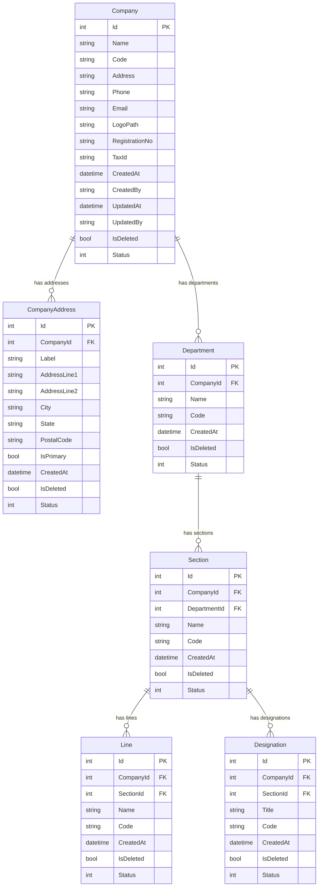

**Unique indexes:**
- `Department`: `(CompanyId, Code)`
- `Section`: `(DepartmentId, Code)`
- `Line`: `(SectionId, Code)`
- `Designation`: `(CompanyId, Code)`

---

## 3. Full ERD — Employee & HR

Central entity connecting organogram, attendance, leave, and payroll.

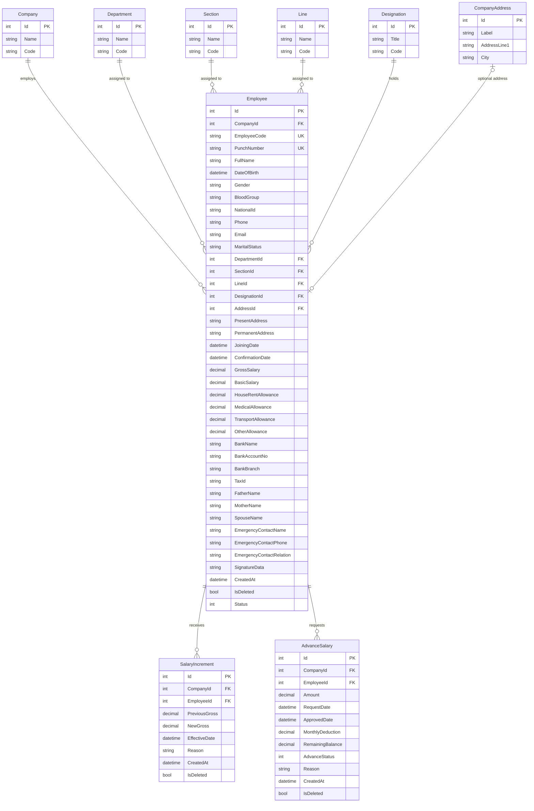

**Unique indexes:**
- `Employee`: `(CompanyId, EmployeeCode)`, `(CompanyId, PunchNumber)`

---

## 4. Full ERD — Shift & Attendance

Raw punch data is processed into daily attendance records used by payroll.

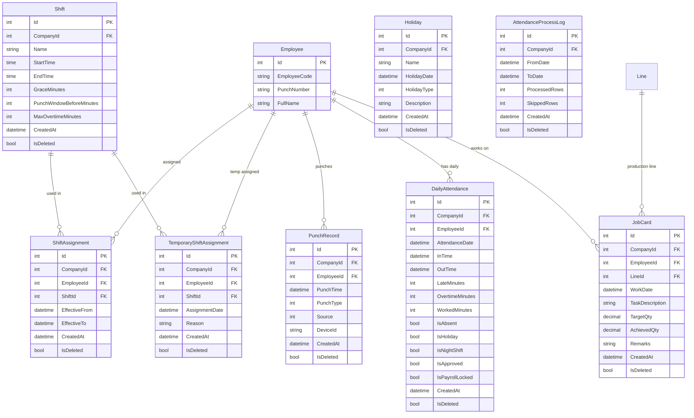

**Unique indexes:**
- `DailyAttendance`: `(CompanyId, EmployeeId, AttendanceDate)`
- `TemporaryShiftAssignment`: `(EmployeeId, AssignmentDate)`
- `Holiday`: `(CompanyId, HolidayDate)`
- `JobCard`: `(CompanyId, WorkDate)`

**Enums:**
- `PunchType`: In / Out
- `PunchSource`: Device, Import, Manual
- `HolidayType`: Public, Company, Optional

---

## 5. Full ERD — Leave Management

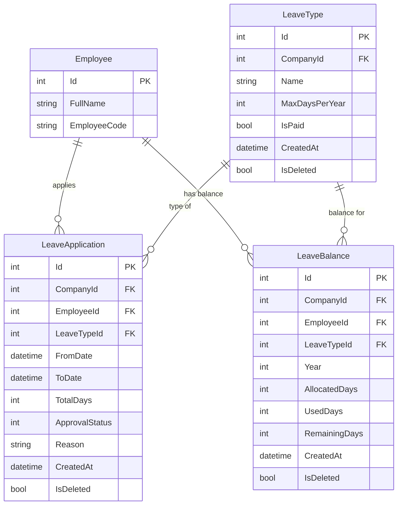

**Unique index:**
- `LeaveBalance`: `(CompanyId, EmployeeId, LeaveTypeId, Year)`

**Enum:**
- `LeaveApprovalStatus`: Pending, Approved, Rejected

---

## 6. Full ERD — Payroll & Compensation

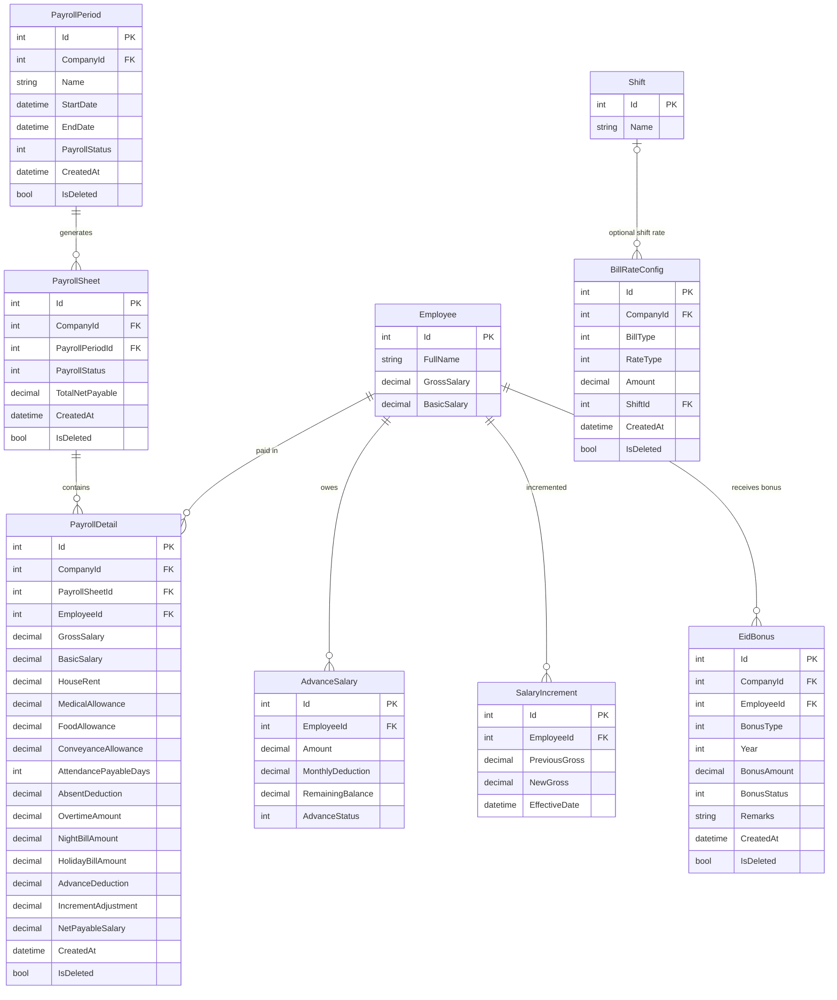

**Enums:**
- `PayrollStatus`: Draft, Generated, Locked
- `BillType`: Night, Holiday
- `BillRateType`: PerHour, PerDay
- `AdvanceSalaryStatus`: Pending, Approved, Rejected, Completed
- `BonusType`: EidUlFitr, EidUlAdha
- `BonusStatus`: Draft, Approved, Paid

**Salary formula (PayrollService):**
```
Medical = 750 | Food = 1250 | Conveyance = 450
Basic = (Gross - 2450) / 1.5
HouseRent = Gross - Basic - 2450
OTRate = Basic / 208 * 2
NetPayable = Gross - AbsentDeduction + OT + NightBill + HolidayBill - AdvanceDeduction
```

---

## 7. Full ERD — Security & Identity

ASP.NET Core Identity tables plus custom permission-based authorization.

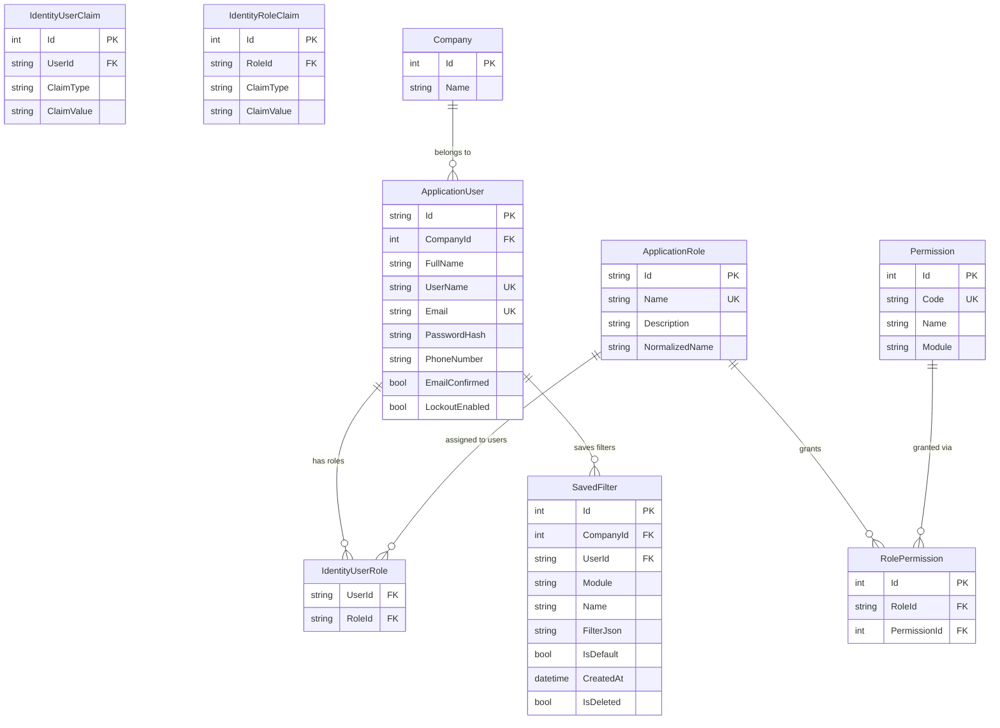

**Identity tables (auto-managed):**
| Table | Purpose |
|-------|---------|
| `AspNetUsers` | `ApplicationUser` — login accounts |
| `AspNetRoles` | `ApplicationRole` — role definitions |
| `AspNetUserRoles` | User ↔ Role many-to-many |
| `AspNetUserClaims` | Per-user claims |
| `AspNetRoleClaims` | Per-role claims |
| `AspNetUserLogins` | External login providers |
| `AspNetUserTokens` | Password reset / 2FA tokens |

**Unique indexes:**
- `Permission.Code`
- `RolePermission`: `(RoleId, PermissionId)`
- `SavedFilter`: `(CompanyId, UserId, Module, Name)`

---

## 8. Consolidated Master ERD

Single diagram showing all primary foreign-key relationships across the entire `ERPHub` database.

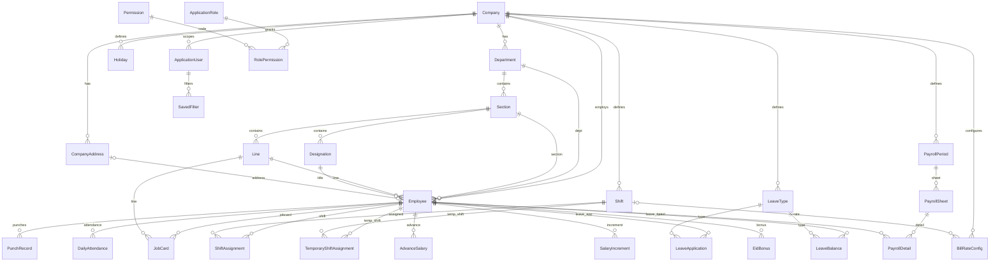

---

## 9. Entity Reference Table

All 30 domain entities + 7 Identity tables.

| # | Entity | Table Name | PK | Key FKs | Module |
|---|--------|------------|----|---------|--------|
| 1 | `Company` | Companies | Id | — | Company |
| 2 | `CompanyAddress` | CompanyAddresses | Id | CompanyId | Company |
| 3 | `Department` | Departments | Id | CompanyId | Organogram |
| 4 | `Section` | Sections | Id | CompanyId, DepartmentId | Organogram |
| 5 | `Line` | Lines | Id | CompanyId, SectionId | Organogram |
| 6 | `Designation` | Designations | Id | CompanyId, SectionId | Organogram |
| 7 | `Employee` | Employees | Id | CompanyId, Dept, Section, Line, Designation, AddressId | HR |
| 8 | `Shift` | Shifts | Id | CompanyId | Shift |
| 9 | `ShiftAssignment` | ShiftAssignments | Id | EmployeeId, ShiftId | Shift |
| 10 | `TemporaryShiftAssignment` | TemporaryShiftAssignments | Id | EmployeeId, ShiftId | Shift |
| 11 | `Holiday` | Holidays | Id | CompanyId | Leave |
| 12 | `PunchRecord` | PunchRecords | Id | EmployeeId | Attendance |
| 13 | `DailyAttendance` | DailyAttendances | Id | EmployeeId | Attendance |
| 14 | `AttendanceProcessLog` | AttendanceProcessLogs | Id | CompanyId | Attendance |
| 15 | `JobCard` | JobCards | Id | EmployeeId, LineId | Attendance |
| 16 | `LeaveType` | LeaveTypes | Id | CompanyId | Leave |
| 17 | `LeaveApplication` | LeaveApplications | Id | EmployeeId, LeaveTypeId | Leave |
| 18 | `LeaveBalance` | LeaveBalances | Id | EmployeeId, LeaveTypeId | Leave |
| 19 | `PayrollPeriod` | PayrollPeriods | Id | CompanyId | Payroll |
| 20 | `PayrollSheet` | PayrollSheets | Id | PayrollPeriodId | Payroll |
| 21 | `PayrollDetail` | PayrollDetails | Id | PayrollSheetId, EmployeeId | Payroll |
| 22 | `BillRateConfig` | BillRateConfigs | Id | CompanyId, ShiftId? | Payroll |
| 23 | `AdvanceSalary` | AdvanceSalaries | Id | EmployeeId | Payroll |
| 24 | `SalaryIncrement` | SalaryIncrements | Id | EmployeeId | Payroll |
| 25 | `EidBonus` | EidBonuses | Id | EmployeeId | Payroll |
| 26 | `SavedFilter` | SavedFilters | Id | CompanyId, UserId | System |
| 27 | `Permission` | Permissions | Id | — | Security |
| 28 | `RolePermission` | RolePermissions | Id | RoleId, PermissionId | Security |
| 29 | `ApplicationUser` | AspNetUsers | Id (string) | CompanyId | Security |
| 30 | `ApplicationRole` | AspNetRoles | Id (string) | — | Security |

**BaseEntity fields** (inherited by most entities):  
`Id`, `CompanyId`, `CreatedAt`, `CreatedBy`, `UpdatedAt`, `UpdatedBy`, `IsDeleted`, `Status`

**Soft-delete:** Global query filters on `IsDeleted = false` for all business entities.

---

## 10. Application Architecture Data Flow

### 10.1 — Request Pipeline (All Modules)

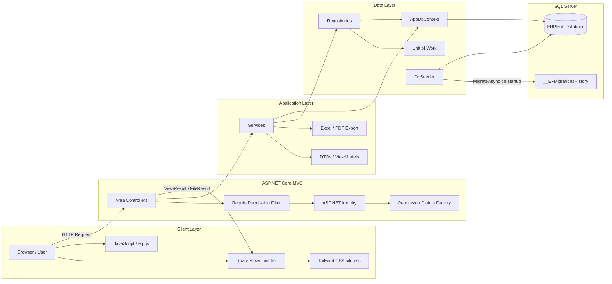

### 10.2 — Layer Responsibilities

| Layer | Components | Responsibility |
|-------|------------|----------------|
| **Presentation** | Controllers, Razor Views, `erp.js` | HTTP handling, UI rendering, form binding |
| **Authorization** | `[RequirePermission]`, `PermissionAuthorizationHandler` | Enforce permission codes per action |
| **Application** | `*Service` classes | Business logic, validation, calculations |
| **Data Access** | `*Repository`, `IRepository<T>`, `UnitOfWork` | CRUD, queries, transactions |
| **Persistence** | `AppDbContext`, EF Core Migrations | ORM mapping, schema versioning |
| **Database** | SQL Server `ERPHub` | Persistent storage |

### 10.3 — Service-to-Entity Map

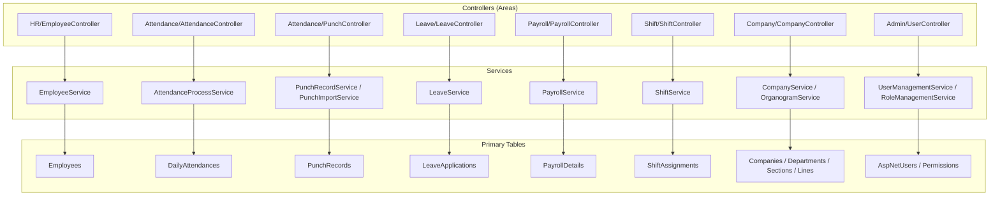

---

## 11. Business Process Data Flows

### 11.1 — Authentication & Authorization Flow

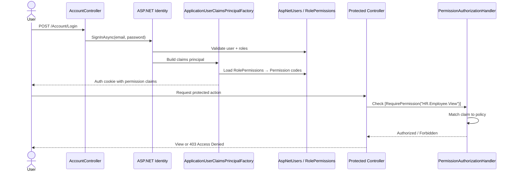

### 11.2 — Punch → Attendance Processing Flow

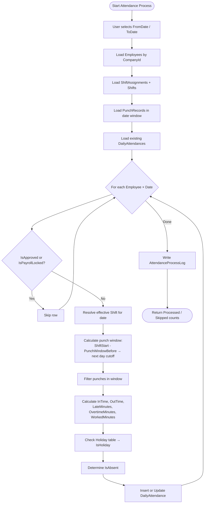

**Data inputs:** `Employees`, `ShiftAssignments`, `Shifts`, `PunchRecords`, `Holidays`  
**Data output:** `DailyAttendances`, `AttendanceProcessLogs`

### 11.3 — Payroll Generation Flow

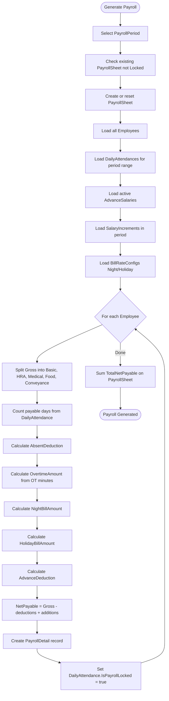

**Data inputs:** `PayrollPeriods`, `Employees`, `DailyAttendances`, `AdvanceSalaries`, `SalaryIncrements`, `BillRateConfigs`  
**Data output:** `PayrollSheets`, `PayrollDetails`, locked `DailyAttendances`

### 11.4 — Leave Application & Approval Flow

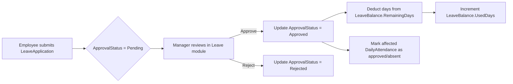

### 11.5 — Employee Onboarding Data Flow

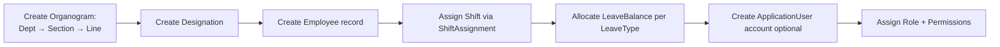

### 11.6 — End-to-End Monthly HR Cycle

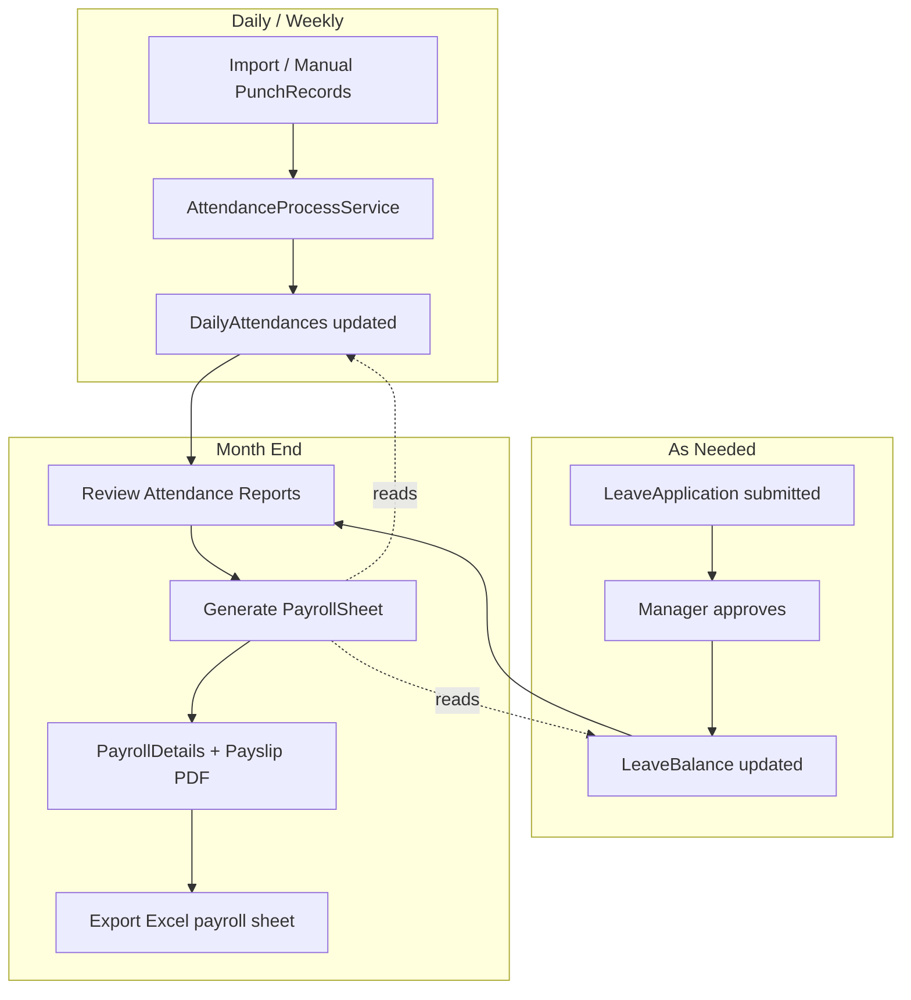

### 11.7 — Export Data Flow

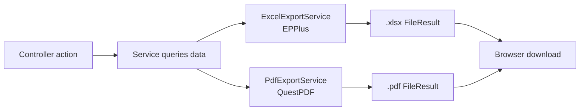

**Export targets:** Employee list, punch records, attendance reports, payroll sheets, employee profile PDF, payslip PDF.

---

## 12. Module-to-Table Mapping

| MVC Area / Route | Controller | Service | Primary Tables |
|------------------|------------|---------|----------------|
| `/HR/Employee` | EmployeeController | EmployeeService | Employees, Departments, Sections, Lines, Designations |
| `/Company/Company` | CompanyController | CompanyService, AddressService | Companies, CompanyAddresses |
| `/Company/Organogram` | OrganogramController | OrganogramService | Departments, Sections, Lines, Designations |
| `/Shift/Shift` | ShiftController | ShiftService | Shifts, ShiftAssignments, TemporaryShiftAssignments |
| `/Attendance/Punch` | PunchController | PunchRecordService, PunchImportService | PunchRecords |
| `/Attendance/Attendance` | AttendanceController | AttendanceProcessService | DailyAttendances, AttendanceProcessLogs, Holidays, JobCards |
| `/Leave/Leave` | LeaveController | LeaveService | LeaveTypes, LeaveApplications, LeaveBalances, Holidays |
| `/Payroll/Payroll` | PayrollController | PayrollService | PayrollPeriods, PayrollSheets, PayrollDetails, BillRateConfigs, AdvanceSalaries, SalaryIncrements, EidBonuses |
| `/Reports/MonthlyReport` | MonthlyReportController | MonthlyReportService | DailyAttendances, PayrollDetails, Employees |
| `/Admin/User` | UserController | UserManagementService | AspNetUsers, AspNetUserRoles |
| `/Admin/Role` | RoleController | RoleManagementService | AspNetRoles, RolePermissions, Permissions |
| `/Account/Login` | AccountController | ASP.NET Identity | AspNetUsers |

---

## Viewing the Diagrams

These diagrams use **Mermaid** syntax. They render automatically in:

- GitHub / GitLab markdown viewers
- VS Code with a Mermaid preview extension
- Cursor markdown preview
- [Mermaid Live Editor](https://mermaid.live)

---

*Generated from ERP Hub source: `ERP.Web/Core/Entities`, `Infrastructure/Data/Configurations`, and `Infrastructure/Services` — June 2026*
